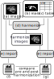

# HABET

## About

The HArmonization BEnchmarking Tool (HABET) streamlines the process of trying multiple different harmonization techniques and evaluating their performance through a simple command-line interface (CLI). Currently, the tool supports harmonization of 3D and 4D NIfTI images of any shape. Support for other file types will be added in the future.
 
The control flow diagram for HABET is shown below. HABET features two main components: harmonization (d) and and report generation (e).



## Harmonization

The harmonization component allows users to easily try multiple different harmonization techniques on their data. The help string for the harmonization subcommand is given below.


```
usage: main.py harmonize [-h] [--mask_path MASK_PATH] --site_colname SITE_COLNAME -o OUTPUT_DIR --harmonization_methods {GlobalScaling,Combat} [{GlobalScaling,Combat} ...] --df_path DF_PATH
                         [--covariate_cols COVARIATE_COLS [COVARIATE_COLS ...]]

optional arguments:
  -h, --help            show this help message and exit
  --mask_path MASK_PATH
                        Path to harmonization mask. Harmonization will only be applied to voxels with intensity value == 1.
  --site_colname SITE_COLNAME
                        name of the site variable column in the table at df_path
  -o OUTPUT_DIR, --output_dir OUTPUT_DIR
                        Root directory of the harmonized images. A subdirectory for each harmonization technique is created. Each of these subdirectories contains the harmonized images for that
                        technique, named exactly the same as in input_dir
  --harmonization_methods {GlobalScaling,Combat} [{GlobalScaling,Combat} ...]
                        Root directory of the harmonized images. A subdirectory for each harmonization technique is created. Each of these subdirectories contains the harmonized images for that
                        technique, named exactly the same as in input_dir
  --df_path DF_PATH     Path to the table matching each image filename to the corresponding site id. Also contains information on any other variables / covariates to include in the harmonization
                        technique
  --covariate_cols COVARIATE_COLS [COVARIATE_COLS ...]
                        Other colnames of covariates to include. Note that columns with numerical values will be treated as continuous and columns with strings will be treated as categorical

```

As a simple example, the below command will harmonize the white matter region in a group of images using ComBat:
```
$ habet/habet/main.py harmonize --mask_path <white_matter_mask_path> --site_colname <site_colname> -o <harmonized_dir> --harmonization_methods Combat --df_path <df_path>
```

HABET also features a simple API for adding custom harmonization techniques. This API is still in its early stages, but at a high level:
1. Add a python file to the `habet/harmonization` directory, giving it the name of the harmonization method you'd like to add
2. In this file, implement a python class that inherits from `HarmonizationMethod` and implements the `_harmonize()` method (see `combat.py` or `global_scaling.py` as examples).

## Report Generation
The report generation of HABET summarizes the detected site-effects. The help string for the report generation subcommand is given below.

```
usage: main.py generate_report [-h] [--mask_path MASK_PATH] --site_colname SITE_COLNAME -o OUTPUT_DIR --im_path_to_site_id_df_path IM_PATH_TO_SITE_ID_DF_PATH [--anova_alpha ANOVA_ALPHA]
                               [--t_test_alpha T_TEST_ALPHA] [--mtc] [--save_dfs]

optional arguments:
  -h, --help            show this help message and exit
  --mask_path MASK_PATH
                        Path to harmonization mask. Harmonization will only be applied to voxels with intensity value == 1.
  --site_colname SITE_COLNAME
                        name of the site variable column in the table at df_path
  -o OUTPUT_DIR, --output_dir OUTPUT_DIR
                        Root directory of the report files.
  --im_path_to_site_id_df_path IM_PATH_TO_SITE_ID_DF_PATH
                        Path to the table matching each image filenameto the corresponding site id
  --anova_alpha ANOVA_ALPHA
                        Significance level for the anova to be done at each voxel
  --t_test_alpha T_TEST_ALPHA
                        Significance level for the t-tests to be done at each voxel
  --mtc                 Conduct Bonferroni multiple testing correction for the anovas and t-tests
  --save_dfs            Save the anova and t-test tables as part of the report Note that these can get large in file size

```

For example, to generate a report for the images harmonized using the command above, you could use the command below:
```
$ habet/habet/main.py generate_report --mask_path <white_matter_mask_path> --site_colname <site_colname> -o <report_dir> --im_path_to_site_id_df_path <harmonized_dir>/Combat/image_to_site.csv
```
## References
HABET was first introduced in the following paper, where it was used to harmonize fractional anisotropy (FA) images from the Adult Brain and Cognitive Development (ABCD) study.

> T. Osika, E. Ebrahim, M. Styner, M. Niethammer, T. Sawyer, A. Enquobahrie, ‘Harmonization Benchmarking Tool for Neuroimaging Datasets’. arXiv, 2022.
>
> [arXiv:2211.07869](https://arxiv.org/abs/2211.07869)

## Acknowledgements
This work was supported in part by the National Institutes of Health under Award Number R42MH118845. The content is solely the responsibility of the authors and does not necessarily represent the official views of the National Institutes of Health.

## Disclaimer
_:warning: This python module is in its early development stage. Its name, content, API, and behavior may change at any time. We mean it!_
